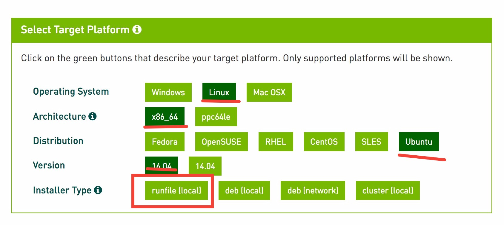
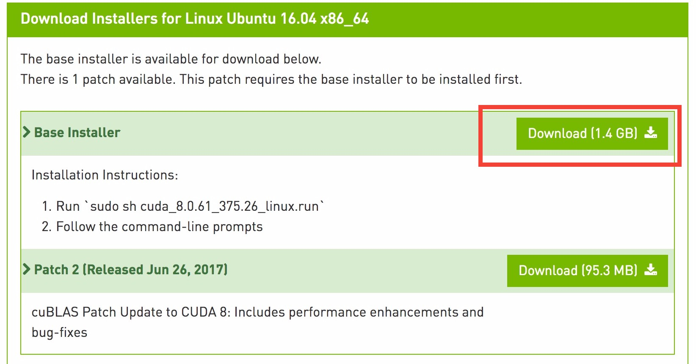
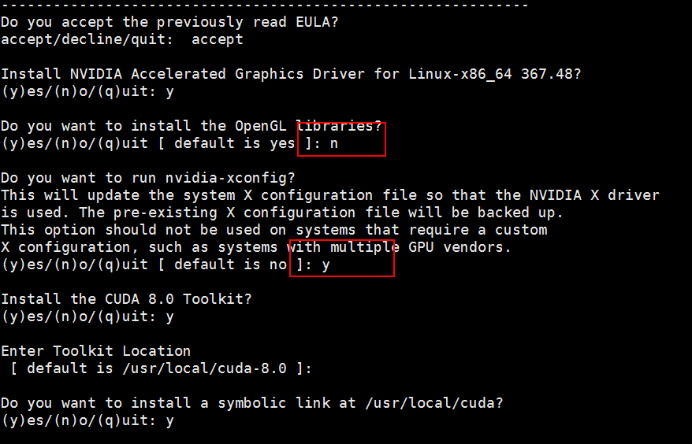

Tensorflow的安装分为CPU与GPU两种方式。后者安装需要确保机器安装有**英伟达显卡**并且英伟达Cuda支持此显卡。如果安装GPU版本的Tensorflow，那么首先需要安装Cuda、CuDNN等软件。

本教程使用的操作系统是Ubuntu16.04。推荐大家使用这个操作系统。


## 基础软件安装

如果您的系统中未安装Python以及相关依赖，首先需要安装这些软件。这里我们推荐安装Python3.6。

### 1. 安装Python

方法一：使用apt安装：

~~~shell
sudo apt-get update  # 升级apt本地索引
sudo apt-get install python3  # 安装最新的python3
~~~

方法二：使用brew安装：

~~~shell
brew install python3
~~~

###2. 安装Python虚拟环境

~~~shell
sudo apt-get install python3-pip python3-dev python-virtualenv
~~~

创建与进入虚拟环境：

~~~shell
# 创建targetDirectory虚拟环境
virtualenv --system-site-packages -p python3 targetDirectory
# 进入虚拟环境
source ~/tensorflow/bin/activate
~~~

进入虚拟环境之后需要确保安装的pip大于等于8.1的版本。执行：

~~~shell
easy_install -U pip
~~~


## CPU版Tensorflow安装教程

CPU版Tensorflow安装方法有很多种，这里我们介绍两种。

### 方法一：使用pip安装

在虚拟环境中执行以下命令：

~~~shell
pip install tensorflow
~~~

等待安装完毕即可。

可以测试一下Tensorflow是否成功安装。在安装了Tensorflow的虚拟环境中进入Python交互式环境，运行：

```python
import tensorflow as tf
hello = tf.constant('Hello, TensorFlow!')
sess = tf.Session()
print(sess.run(hello))
```

输出`b'hello TensorFlow'`。则表示成功安装。


这种方法安装最为简便，但可能无法发挥CPU的所有性能，如果需要让算法跑的更快一些，可以进行编译安装。

###方法二：编译安装

这里，我们推荐使用Bazel进行编译安装。

1. 确认安装了gcc，并且推荐使用gcc4。

2. 安装bazel

   可以使用apt安装：

   ```shell
   sudo apt-get update && sudo apt-get install bazel
   ```

   如果安装出错或者提示缺少依赖，可以参考[此处](https://docs.bazel.build/versions/master/install-ubuntu.html)。

3. 安装Python依赖：

   ~~~python
   sudo apt-get install python3-numpy python3-dev python3-pip python3-wheel
   ~~~

   也可以在虚拟环境中使用pip进行安装。

4. 下载Tensorflow。

   ~~~shell
   git clone https://github.com/tensorflow/tensorflow 
   ~~~

   进入Tensorflow，并切换到最新版（目前为v1.3）。

   ~~~shell
   cd tensorflow
   git checkout v1.3.0
   ~~~

5. 执行configure

   ~~~shell
   ./configure
   ~~~

6. 使用bazel构建pip包：

   ~~~shell
   bazel build -c opt --copt=-march=native //tensorflow/tools/pip_package:build_pip_package
   ~~~

7. 生成whl文件。生成的文件放在/tmp/tensorflow_pkg目录中。执行：

   ~~~shell
   bazel-bin/tensorflow/tools/pip_package/build_pip_package /tmp/tensorflow_pkg
   ~~~

8. 使用pip安装生成的whl文件（注意，我这里是`tensorflow-1.3.0-cp35-cp35m-macosx_10_11_x86_64.whl`，不同的操作系统与Python版本，生成的whl文件名也不同）。：

   ~~~shell
   pip install /tmp/tensorflow_pkg/tensorflow-1.3.0-py3-none-any.whl
   ~~~

到此安装完毕。可以测试一下Tensorflow是否成功安装。在安装了Tensorflow的虚拟环境中进入Python交互式环境，运行：

~~~python
import tensorflow as tf
hello = tf.constant('Hello, TensorFlow!')
sess = tf.Session()
print(sess.run(hello))
~~~

输出`b'hello TensorFlow'`。则表示成功安装。


##GPU版Tensorflow安装教程

GPU版本的安装首先需要安装英伟达的CUDA与CuDNN。然后才需要安装Tensorflow，Tensorflow的安装也可以使用pip或者源码编译等方法安装。这里着重介绍CUDA的安装。安装流程如下：

### 1. 验证安装

* 确保电脑安装了英伟达的显卡并且支持cuda。[在此查看](https://developer.nvidia.com/cuda-gpus)

* 确认安装了gcc，并且推荐使用gcc4。

  有些操作系统

注意：有些操作系统安装了某些开源驱动需要禁用才行。

### 2. 下载并安装cuda

选择对应的操作系统版本，下载cuda文件。[CUDA下载地址](https://developer.nvidia.com/cuda-downloads)。如下图：



这里我们选择了runfile选项，推荐使用这种方法安装。



下载完成之后运行这个文件，执行：

~~~shell
sudo sh cuda_8.0.61_375.26_linux.run
~~~

如果已经安装了显卡驱动，则不需要选择安装显卡驱动。一般建议这样做，cuda自带的驱动总会出一些问题。显卡驱动安装方法如下：

~~~shell
sudo apt-get install nvidia-xxx # xxx 根据自己的驱动来
~~~

如果你选择了安装显卡驱动，这时候会有一些选项需要您手动选择，这个**很重要。**否则可能会使系统出现问题！！！

通常我们不需要安装OpenGL。




安装完成之后需要添加环境变量。在`~/.bash_profile`、`~/.bashrc`等文件中（这里使用的是bash）的末尾添加下面的内容：

~~~shell
export LD_LIBRARY_PATH="$LD_LIBRARY_PATH:/usr/local/cuda/lib64:/usr/local/cuda/extras/CUPTI/lib64"
export CUDA_HOME=/usr/local/cuda
~~~

或者执行如下命令：

~~~shell
echo 'export LD_LIBRARY_PATH="$LD_LIBRARY_PATH:/usr/local/cuda/lib64:/usr/local/cuda/extras/CUPTI/lib64"' >> ~/.bash_profile
echo 'export CUDA_HOME=/usr/local/cuda' >> ~/.bash_profile
~~~

到此CUDA安装完毕。

安装完毕之后，可以重启终端或者执行如下命令，即可生效。

~~~shell
source ~/.bash_profile
~~~


### 3. 下载并安装cuDNN

下载cuDNN需要注册。[CuDNN下载地址](https://developer.nvidia.com/rdp/cudnn-download)

这里我们使用1.3版本的Tensorflow，所以选择v6版本的cuDNN。之前的TF需要选择v5.1的cuDNN。


然后选择对应的linux版本即可，这里我们推荐使用deb文件安装：


执行如下命令：

~~~shell
sudo dpkg -i filename.deb
~~~

到此cuDNN安装完毕。

*注意：也可以直接下载cuDNN，然后解压到CUDA的相应目录。*

###4. 安装GPU版Tensorflow

这里，我们依然可以选择使用pip安装或使用源码编译安装。

方法一：使用pip安装。

~~~shell
pip install tensorflow-gpu
~~~

安装完毕。可以使用上面提到的验证方法验证。同样的这样安装无法完全发挥cpu的性能。可以使用编译安装。


方法二：编译安装。

编译安装与上面提到cpu版本的编译安装差不多，只有第6步，使用bazel构建pip包的命令稍有差异，如下：

~~~shell
bazel build -c opt --copt=-march=native --config=cuda -k //tensorflow/tools/pip_package:build_pip_package
~~~

编译安装之后，可以利用上面提到的验证方法验证安装是否成功。


